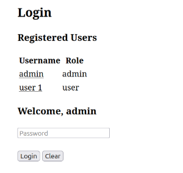
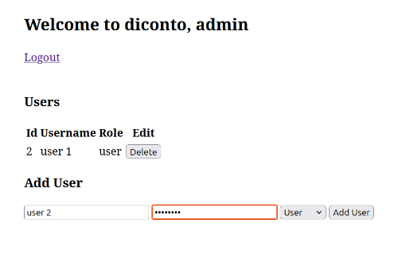
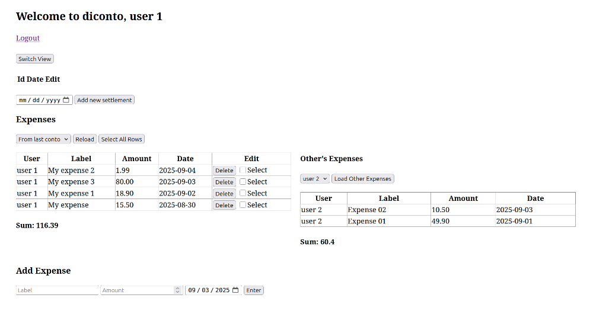
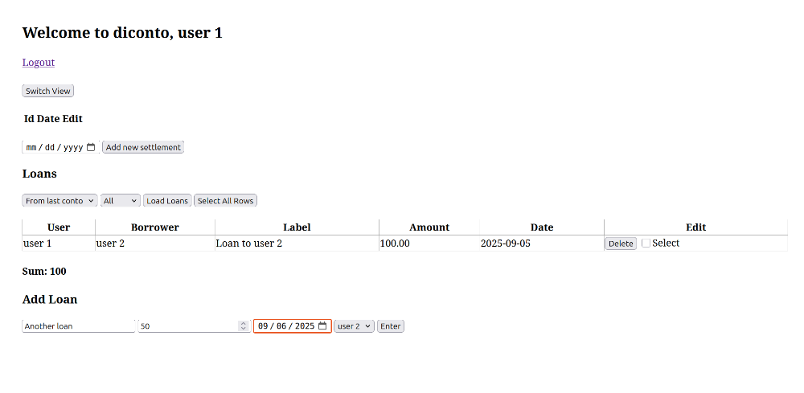
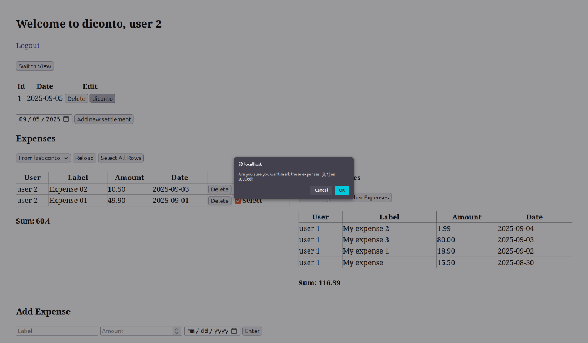
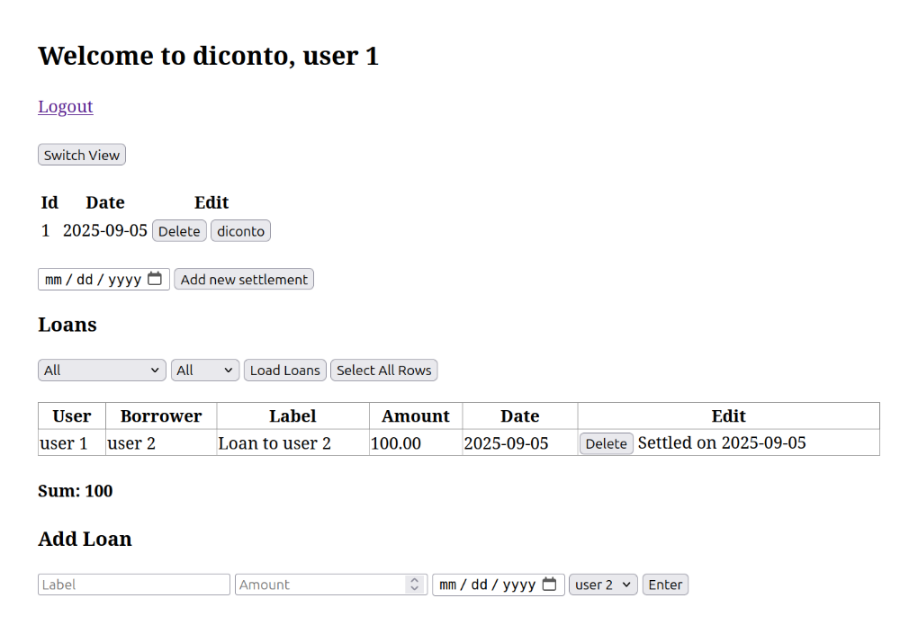

# Diconto – Family Expenses & Loans Tracker

Diconto is a simple PHP/MySQL web application to help you and your family keep track of **expenses** and **loans**.  
You can log who paid for what, keep records of borrowed money, and mark items as **settled** when balances are evened out.  

I originally built Diconto to run on my **Synology DiskStation**, so it works perfectly with Synology’s built-in web server and MariaDB.  
It also runs on any standard Apache2 + PHP + MySQL/MariaDB setup (like XAMPP on your computer).  

---

## Features

- **Multi-user support**:  
  - An **admin account** is created by default.  
  - The **admin can add new users** and **delete users**.
  - Normal users can add expenses and loans.  

- **Track expenses**: Add shared expenses and assign them to a user.  
- **Manage loans**: Record loans between users.  
- **Settlements**: Mark expenses and loans as settled once money is given/received.  
- **Overview table**: See a history of transactions with dates and amounts. 

---

## Screenshots

### Login Page
Users can log in by clicking their name and entering their password.  
The **admin user** can create new accounts here.  

### Homepage with Expenses
A simple table lists all expenses, with inputs at the bottom to add new ones.  

### Loans
Record loans with amounts and dates.  

### Settlements
When you repay or receive money, you can mark a settlement and the app updates balances.  

---

## Installation

### Requirements
- PHP 8+
- MariaDB / MySQL
- Apache2 (or Synology **Web Station** / XAMPP)

### Steps
1. Clone or copy the project to your web root (`htdocs` or `/volume1/web/` on Synology).  
2. Run the `init.sql` file into MySQL (via phpMyAdmin or CLI).  
3. Update your `utils/db.php` with your DB credentials.  
4. Open in browser at `http://localhost/diconto` (on PC) or `http://<your-nas-ip>/diconto` (on Synology).  

---

## Usage
- Log in with the **admin user** (default).  
- The admin can **add new users** and **delete users**.  
- **Users** can:
  - Add expenses  
  - Add loans  
  - Mark them as settled  

Tables update dynamically without reloading the page.  

---

## License
Feel free to modify it for your needs.
